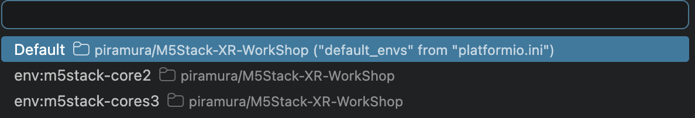
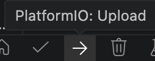
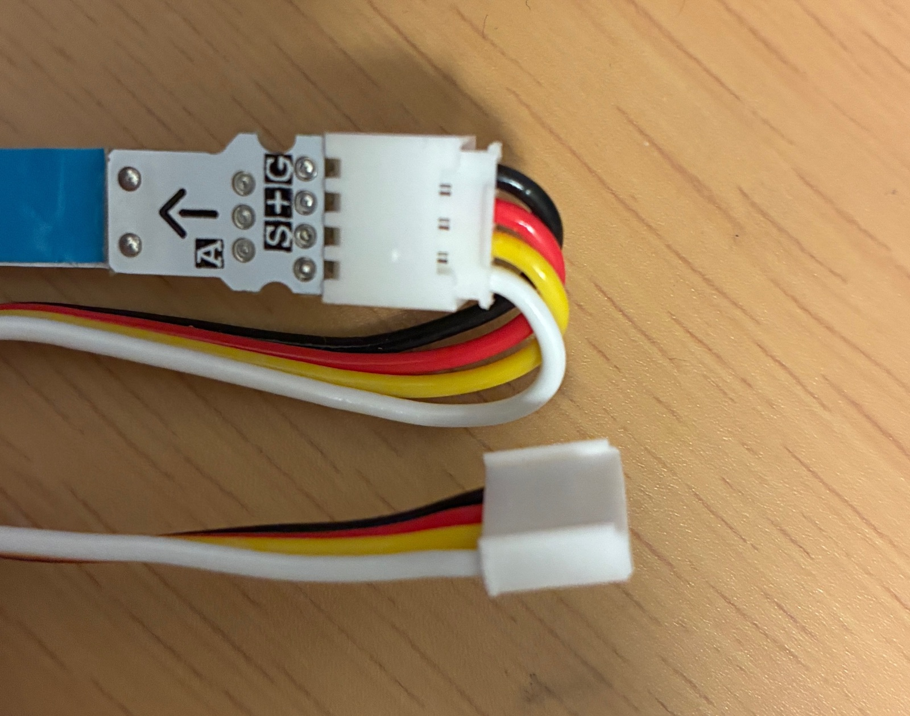
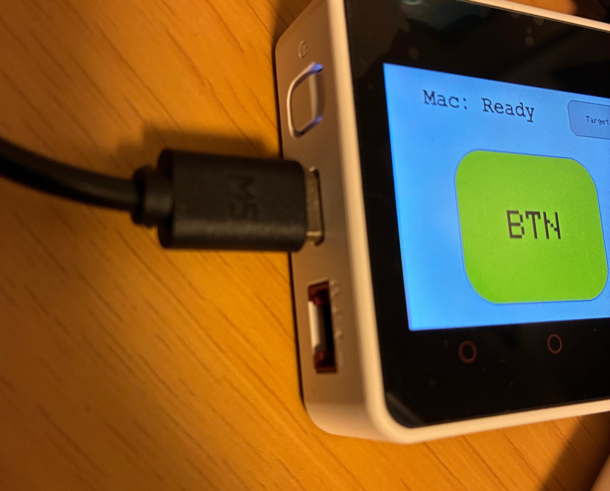

# M5Stack XR Workshop

M5Stackのタッチ入力に合わせてSK6812 LEDテープを点灯し、タッチイベントとIMUの姿勢データ（クォータニオン）をUnityへOSC送信するワークショップ用プロジェクトです。

対応状況:

- M5Stack Core2：ビルド・動作確認済み
- M5Stack CoreS3：ビルド対応済み・動作検証中

## 前提環境

- [Git](https://git-scm.com/downloads)
- [Visual Studio Code](https://code.visualstudio.com/download)
- データ通信対応のUSBケーブル
- インターネット接続

## 事前準備

イベント当日までに、PlatformIO IDEの導入と初回ビルドを完了してください。初回ビルドではOSCが無効になっているため、Wi-Fi設定は不要です。

### PlatformIO IDEの導入

1. Visual Studio Codeを起動し、左側の「拡張機能」アイコンを開きます。

2. `PlatformIO IDE`を検索してインストールします。

3. 再起動を求められた場合は、Visual Studio Codeを再起動します。

### プロジェクトの準備

1. ターミナルを開き、次のコマンドでこのリポジトリをcloneします。

   ```bash
   git clone https://github.com/piramura/M5Stack-XR-WorkShop.git
   cd M5Stack-XR-WorkShop
   ```

2. Visual Studio Codeの「ファイル」→「フォルダーを開く」を選択し、cloneした`M5Stack-XR-WorkShop`フォルダを開きます。

   `platformio.ini`がVisual Studio Codeのファイル一覧の直下に表示されていることを確認してください。

3. PlatformIOの初期化とライブラリの自動インストールが終わるまで待ちます。

   初回はダウンロードに数分かかることがあります。インターネットへ接続した状態で実行してください。

4. 画面下部のステータスバーにある✓（Build）アイコンをクリックします。

5. ターミナルの最後に次の表示が出れば、事前準備は完了です。

   ```text
   [SUCCESS]
   ```

## 当日

以下は、作業中に詰まった場合の確認用です。

### ビルド対象の選択






1. Core2を使用する場合は、ステータスバーの環境名をクリックし、`env:m5stack-core2`を選択します。

   `Default`は`platformio.ini`の`default_envs`を使用します。現在はCore2がデフォルトのビルド対象です。

2. CoreS3を使用する場合は、ステータスバーの環境名をクリックし、`env:m5stack-cores3`を選択します。

   CoreS3はビルド対応済みですが、実機動作は検証中です。

3. ステータスバーの✓（Build）アイコンをクリックし、`[SUCCESS]`になることを確認します。

### M5StackへのUpload

1. M5Stackをデータ通信対応のUSBケーブルでPCへ接続します。

2. 「ビルド対象の選択」に掲載したステータスバー画像の→（Upload）アイコンをクリックします。

3. シリアルポートの選択画面が表示された場合は、M5Stackを接続したポートを選択します。

   - macOS：`/dev/cu.usbserial-*`または`/dev/cu.usbmodem*`
   - Windows：`COM3`などの`COM`番号

4. ポートが分からない場合は、一度M5Stackを外し、再接続したときに追加されたポートを選択します。

5. ターミナルの最後に`[SUCCESS]`と表示されたことを確認します。

### SK6812 LEDテープの配線

1. M5StackとLEDテープの電源を切ります。

2. LEDテープの入力側コネクタを確認します。`DIN`表記または矢印の始点側が入力です。

   

3. LEDテープ入力側のコネクタを、M5Stack本体のPort Aへ差し込みます。配線はPort Aへの接続だけで完了します。

   | SK6812 | Core2 | CoreS3 |
   | --- | --- | --- |
   | `DIN` | GPIO32 | GPIO2 |
   | `5V` | 5V | 5V |
   | `GND` | GND | GND |

   

4. `5V`と`GND`を逆に接続していないことを確認してから電源を入れます。

5. Upload後、画面中央のボタンをタッチし、LEDテープが青く点灯することを確認します。

### Wi-FiとOSCの設定

1. `include/wifi_config.example.h`を同じフォルダ内へコピーし、ファイル名を`wifi_config.h`に変更します。

   macOSまたはLinux:

   ```bash
   cp include/wifi_config.example.h include/wifi_config.h
   ```

   Windows PowerShell:

   ```powershell
   Copy-Item include/wifi_config.example.h include/wifi_config.h
   ```

2. `include/wifi_config.h`を開き、Wi-Fi情報とOSC送信先を編集します。

   ```cpp
   static constexpr const char* WIFI_SSID = "YOUR_WIFI_SSID";
   static constexpr const char* WIFI_PASSWORD = "YOUR_WIFI_PASSWORD";

   struct OscDestination {
     const char* name;
     const char* host;
   };

   static constexpr OscDestination OSC_DESTINATIONS[] = {
       {"PC A", "192.168.0.10"},
       {"PC B", "192.168.0.11"},
       {"PC C", "192.168.0.12"},
   };

   static constexpr uint16_t UNITY_OSC_PORT = 9000;
   ```

   - `WIFI_SSID`：M5Stackを接続するWi-Fi名
   - `WIFI_PASSWORD`：Wi-Fiのパスワード
   - `OSC_DESTINATIONS`：画面に表示する名前とUnityを実行する端末のIPv4アドレス
   - `UNITY_OSC_PORT`：Unity側のOSC受信ポート

   送信先は1〜3件設定できます。使用しない送信先は、その行を`//`でコメントアウトしてください。

   `UNITY_OSC_PORT`は、Unity側で設定した受信ポートと同じ番号にしてください。PCのIPアドレスは[ネットワーク設定手順](docs/network-setup.md)で確認できます。

3. M5StackとUnityを実行するPCが、同じWi-Fiへ接続されていることを確認します。

4. `src/osc_transport.h`を開き、次の行のコメントを外してOSCを有効にします。

   変更前:

   ```cpp
   // #define ENABLE_OSC
   ```

   変更後:

   ```cpp
   #define ENABLE_OSC
   ```

5. ステータスバーの✓（Build）アイコンをクリックし、`[SUCCESS]`になることを確認します。

6. ステータスバーの→（Upload）アイコンをクリックし、M5Stackへ書き込みます。

7. 起動後に送信先を選択します。操作画面の「Target」を押すと送信先を変更できます。
